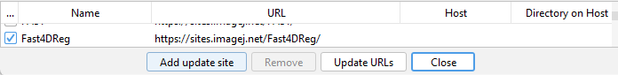
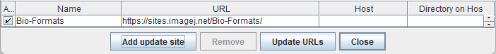

# What is Fast4DReg?

Unwanted sample drift is a common issue that plagues microscopy experiments, preventing accurate temporal visualization and quantification of biological processes. Although multiple methods and tools exist to correct images post acquisition, performing drift correction of three-dimensional (3D) videos using open-source solutions remains challenging and time consuming. 

Fast4DReg is a Fiji plugin that can quickly correct axial and lateral drift in 3D video-microscopy datasets. Fast4DReg works by creating intensity projections along multiple axes and estimating the drift between frames using two-dimensional cross-correlations. Fast4DReg can be used to register misaligned channels in 3D using either calibration slides or misaligned images directly. More details can be found here: https://github.com/guijacquemet/Fast4DReg

Altogether, Fast4DReg provides a quick and easy-to-use method to correct 3D imaging data before further visualization and analysis.

# Fast4DReg_training

Drift correction for 3D fluorescence time-lapse data

During this workshop you will learn about how Fast4DReg works, where to get it and practise it’s usage using example data in the hands-one excercises. It is also possible to work on your own data.

# Fast4DReg installation

Fast4DReg is easy to istall by enabling the Fast4DReg update site:
- Open ImageJ 
- Navigate to *Help -> Update -> Manage update sites*
- Select Fast4DReg

- When selected select *Close* and *Apply changes*. 
- Restart Fiji.

### Dependencies

Fast4DReg is dependent on **Bio-Formats**, which can be installed through the Fiji update site: 
- Open ImageJ 
- Navigate to *Help -> Update -> Manage update sites*
- Select Bio-Formats

- When selected select *Close* and *Apply changes*. 
- Restart Fiji.

# Reference paper

If you are using this tool for your research, please cite:

Pylvänäinen, J. W., Laine, R. F., Saraiva, B. M. S., Ghimire, S., Follain, G., Henriques, R., & Jacquemet, G. (2023). Fast4DReg - fast registration of 4D microscopy datasets. Journal of cell science, 136(4), jcs260728. https://doi.org/10.1242/jcs.260728
